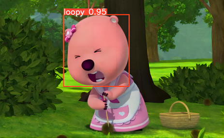
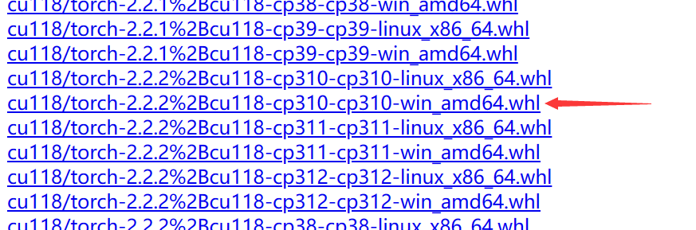
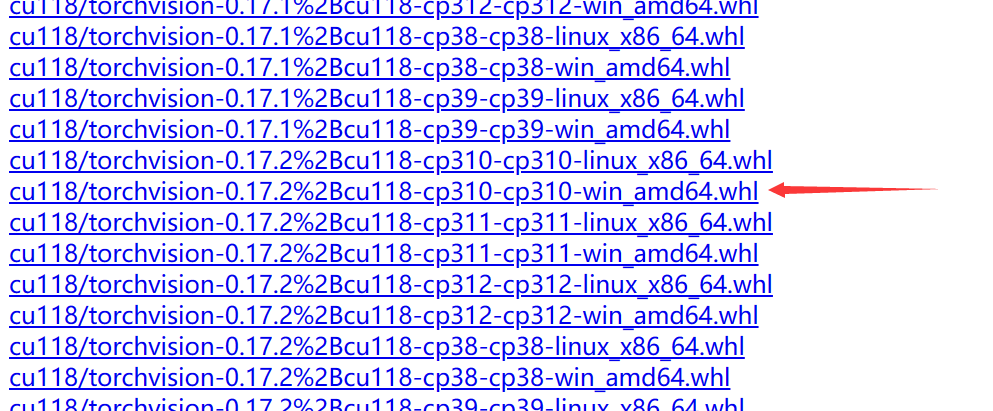
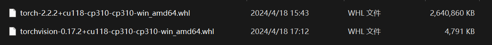
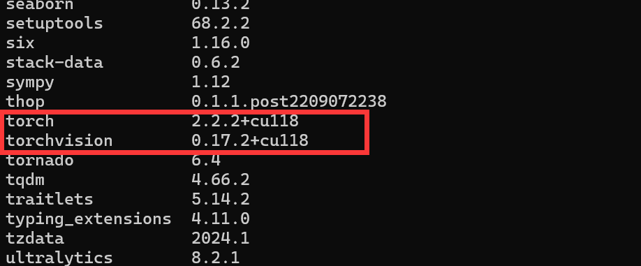

# YOLOv8-loopy



## 1.环境配置

conda 安装

```
conda create -n yolov8-loopy python==3.10
conda activate yolov8-loopy
pip install ultralytics
```

安装 ultralytics 时会自动安装 pytorch 和 torchvision，但不是 GPU 版本，因此需要卸载后自己手动安装支持 GPU 版本。

```
pip uninstall torch, torchvision
```

根据自己的 cuda 版本安装对应的 torch 和 torchvision。

下载地址：[download.pytorch.org/whl/torch_stable.html](https://download.pytorch.org/whl/torch_stable.html)

下载好 whl 文件后再使用 pip 安装。

例如，我自己的电脑安装的是 CUDA 11.8，于是下载了 2.2.2 版本。



然后去安装 torchvision。同样地，需要注意与 CUDA 和 Python 版本对应。例如我选的是 0.17.2 版本。



以上 2 个文件下载到本地后都是 whl 扩展名。然后使用 pip 安装即可。



先安装 torchvision 再安装 torch。

```
conda activate yolov8-loopy
pip install .\torchvision-0.17.2+cu118-cp310-cp310-win_amd64.whl
pip install .\torch-2.2.2+cu118-cp310-cp310-win_amd64.whl
```

最后可以使用 `pip list`查看是否安装成功。如果是 CPU 版本的是不会写“+cu xxx”的。



**以上示例只是针对我个人安装了 CUDA11.8 的情况，实际需要下载的文件需要根据自己电脑 CUDA 版本选择。**

## 2.训练

图像放在 dataset/images 下，划分为 train 和 val，标签放在 dataset/labels 下，和 images 一样划分

修改 yaml 文件

训练：

```
python train.py
```

模型保存在 runs/detect/train 下

## 3.推理

在 detcet.py 中设置好需要推理的文件和模型

```
python detect.py
```

输出文件在 runs/detect/predict 下
