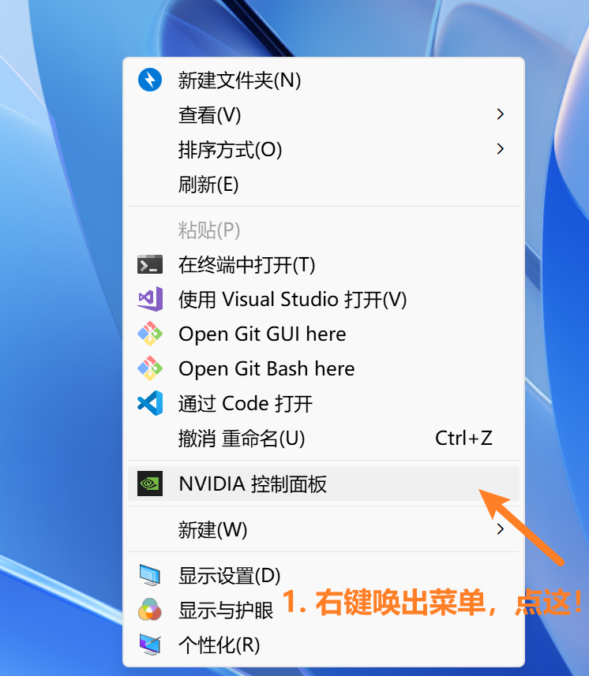
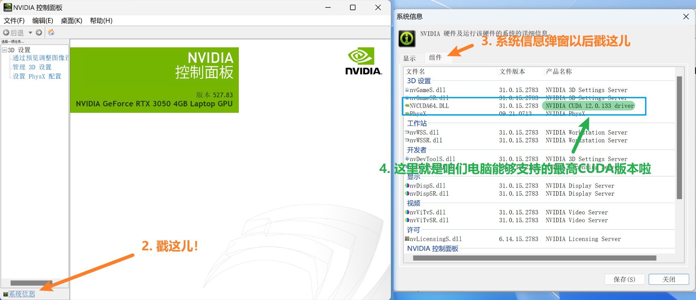

# YOLOv8-loopy


- **原README的Markdown文档** ： [Orignal README](README-Old.md)
- **同时感谢原作者的开源贡献** ：[hb2cpc](https://github.com/hb2cpc)

## 1.环境配置

conda 安装

```
conda create -n yolov8-loopy python==3.10
conda activate yolov8-loopy
pip install ultralytics
```

安装 ultralytics 时会自动安装 pytorch 和 torchvision，但不是 GPU 版本，因此需要卸载后自己手动安装支持 GPU 版本。

```
pip uninstall torch torchvision
```

根据自己的 cuda 版本安装对应的 torch 和 torchvision。

此处演示如何查看本地的NVIDIA显卡的CUDA版本：



所以，此处可以看出我的电脑可以兼容至CUDA12.0的版本！

接下来，我们去[torch官网](https://pytorch.org/)获取下载指令。


```shell
# 先激活conda环境避免下载错地方，已经激活的就省略这步
conda activate yolov8-loopy
# 把复制下来的指令执行
pip3 install torch torchvision torchaudio --index-url https://download.pytorch.org/whl/cu118
```

最后可以使用 `pip list`查看是否安装成功。如果是 CPU 版本的是不会写“+cu xxx”的。


**以上示例只是针对我个人安装了 CUDA11.8 的情况，实际需要下载的文件需要根据自己电脑 CUDA 版本选择。**

## 2.训练

图像放在 dataset/images 下，划分为 train 和 val，标签放在 dataset/labels 下，和 images 一样划分

修改 yaml 文件

训练：

```
python train.py
```

模型保存在 runs/detect/train 下

## 3.推理

在 detcet.py 中设置好需要推理的文件和模型

```
python detect.py
```

输出文件在 runs/detect/predict 下
